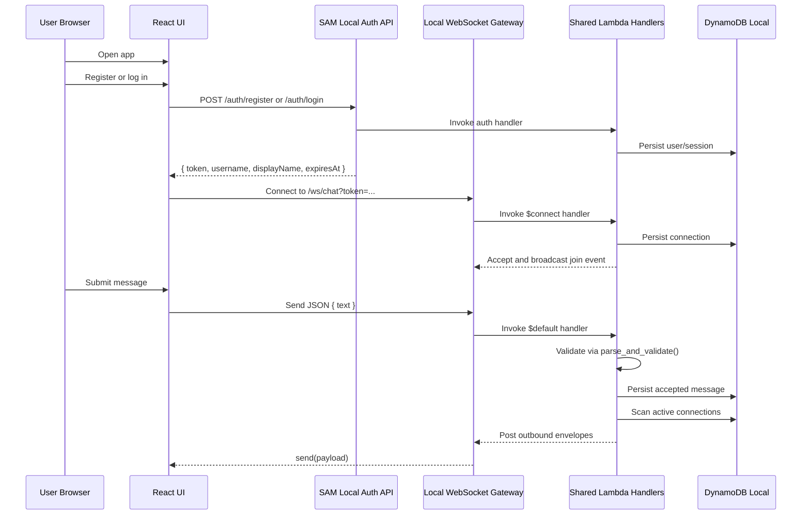
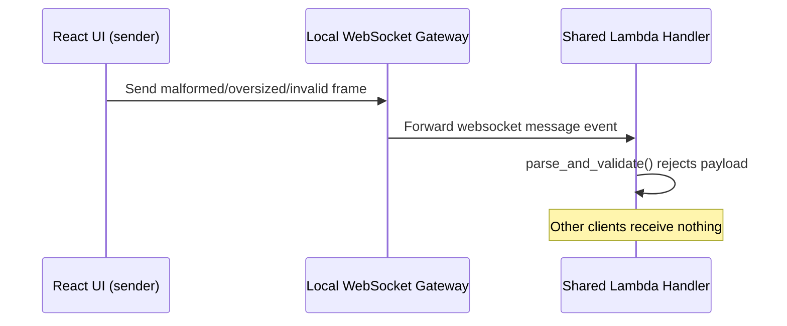

# Data Flow

## Main Chat Sequence

## Flow: Register Or Login

1. User enters username/password and, for registration, a display name.
2. Frontend uses `VITE_AUTH_BASE_URL` when present; otherwise it derives the auth base URL from `VITE_CHAT_WS_URL` by switching the scheme from `ws` to `http` and replacing the trailing `/ws/chat` with `/auth`.
3. Frontend calls `POST /auth/register` or `POST /auth/login`.
4. Backend validates credentials, creates a fixed-expiry session token, persists it in the active runtime store, and returns `{ token, username, displayName, expiresAt }`.

## Flow: Load Recent History

1. After sign-in succeeds, frontend calls `GET /auth/messages?limit=25` with `Authorization: Bearer <token>`.
2. Backend validates the bearer token against the current session store.
3. Supported AWS-local and AWS paths query the persisted `Messages` table in DynamoDB or DynamoDB Local; the direct Axum helper path reads the recent in-memory message list.
4. Backend returns the newest saved messages in chronological order plus `hasMore` and `nextBefore` cursor metadata.
5. Frontend renders the returned messages before live websocket traffic continues to append new ones.

## Flow: Load Older History While Scrolling Backward

1. User scrolls near the top of the message list.
2. Frontend calls `GET /auth/messages?limit=25&before=<oldestLoadedMessageId>`.
3. Backend returns the next older page in chronological order.
4. Frontend prepends the page, preserves scroll position, and repeats only while `hasMore` remains true.

## Flow: Logout

1. Frontend sends `POST /auth/logout` with `Authorization: Bearer <token>`.
2. Backend revokes the token from the session store used by the current runtime path.
3. Future WebSocket connections with that token are rejected.

## Flow: Client Connect

1. Browser loads frontend and constructs WebSocket client after a session token is available.
2. Client connects to `ws://127.0.0.1:3001/ws/chat?token=...` in the supported local workflow.
3. Backend checks the request `Origin` header against the configured allowlist and rejects the socket with close code `1008` when the origin is not allowed.
4. Shared handler code looks up the session token, rejects expired or revoked sessions, and closes the socket when auth fails.
5. Shared handler code registers the connection in DynamoDB or DynamoDB Local.
6. Backend broadcasts a system join event using the authenticated display name.

## Flow: Send Message

1. User submits message in frontend composer.
2. Frontend sends JSON payload: `{ text: string }`.
3. Gateway forwards the text frame to the shared `$default` handler, which passes it to `parse_and_validate()`.
4. If validation fails, backend rejects the frame; the exact error-envelope behavior differs between the local Axum helper path and the Lambda-oriented websocket path.
5. If `text` is blank after strip, frame is silently discarded; loop continues.
6. Backend persists the normalized message event, then broadcasts it to all connected clients, stamping sender from the authenticated session:
   - `id: stable message id`
   - `type: "message"`
   - `sender: string`
   - `text: string`
   - `sentAt: ISO timestamp`

## Flow: Validation Error Path

## Validation Rules Reference

| Field | Rule |
|---|---|
| Frame | ≤ 4 096 bytes (UTF-8) |
| JSON | Must be parseable as a JSON object |
| `text` | Required; must be `str`; non-empty after strip; ≤ 1 000 chars |
| `sender` | Server-owned; clients must not send it |

## Flow: Health Check

1. Client (human or monitor) calls `GET /health`.
2. Backend returns `{ "status": "ok" }`.

## Flow: Disconnect

1. The websocket gateway or API Gateway route exits because of client disconnect or another runtime failure.
2. Shared handler code removes the connection record from DynamoDB or DynamoDB Local.
3. Local gateway also removes the transient local peer sender if present.
4. Backend attempts to broadcast a system leave event to remaining clients.
5. If leave-message broadcast fails, backend logs the error and preserves cleanup completion.

## Integration Boundaries

- Frontend <-> Backend boundary: HTTP JSON auth endpoints plus WebSocket JSON chat protocol.
- Frontend runtime config boundary: `VITE_CHAT_WS_URL` must resolve to the websocket gateway or deployed WebSocket API; `VITE_AUTH_BASE_URL` may explicitly point at the matching auth API.
- Backend runtime config boundary: `ALLOWED_ORIGINS`, `SESSION_TTL_SECONDS`, AWS table names, and local AWS endpoint settings define auth, persistence, history pagination, and local routing behavior.
- External systems: DynamoDB Local for supported local runs and DynamoDB/API Gateway in AWS.
