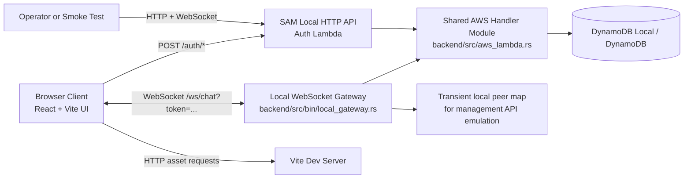

# System Overview

## Goals

- Provide a simple real-time chat experience for multiple browser clients.
- Keep one backend codebase that runs through the same AWS-oriented handler model locally and in AWS.

## Scan First (Traffic Light)

- 🔴 Act now: deployed AWS validation, CI/CD enforcement, and alarm routing remain the key blockers for launch confidence.
- 🟡 Watch closely: reliability, resilience, and delivery speed are still constrained by missing CI/CD, untuned alert thresholds, and non-local release enforcement for deployed smoke validation.
- 🟢 Stable base: auth/session guardrails, payload validation, backend modular separation, and baseline CloudWatch visibility are in place.

## Boundaries

- Frontend runtime: browser, served by Vite dev server (`frontend/`).
- Supported local backend runtime: DynamoDB Local, `sam local start-api`, and the local websocket gateway in `backend/src/bin/local_gateway.rs`.
- Additional local convenience runtime: `docker-compose.yml` can run frontend + direct Axum backend (`backend/src/main.rs`) for one-command local bring-up.
- Shared backend module: `backend/src/aws_lambda.rs` plus shared auth/validation code in `backend/src/lib.rs`.
- Optional local-only library runtime: `backend/src/lib.rs` still contains Axum-based app wiring used by tests and shared logic, but it is not the supported local backend entrypoint.
- Persistence: DynamoDB in AWS and DynamoDB Local for the supported local backend path.
- Wire protocol: unversioned JSON messages over a single WebSocket endpoint.

## Production Target Boundary

- Target frontend runtime: S3 + CloudFront.
- Target auth runtime: API Gateway HTTP API + Lambda.
- Target chat runtime: API Gateway WebSocket API + Lambda.
- Target persistence: DynamoDB for users, sessions, and active connections.
- Current status: the shared `backend/` crate now contains working Lambda handlers for DynamoDB-backed auth/session/connection state and API Gateway fan-out, plus a documented SAM local workflow; deployment automation and production operations remain incomplete.

## Runtime Context Narrative

- Users open the React app, register or log in over HTTP, then connect over WebSocket with a fixed-lifetime session token.
- The supported local backend path runs the auth API through SAM and websocket traffic through the local gateway, both backed by the shared AWS-oriented handler code.
- The deployed validation path now reuses that same round-trip contract against AWS by resolving `HttpApiUrl` and `WebSocketApiUrl` outputs and running the shared smoke test flow against the real handlers.
- Local startup tooling now performs explicit dependency checks for DynamoDB reachability and SAM build output before launching the SAM API or local websocket gateway.
- Shared handler code tracks users, sessions, and active connection IDs in DynamoDB or DynamoDB Local.
- Local gateway keeps only transient in-process socket senders so it can emulate the API Gateway Management API fan-out surface.
- Backend enforces an origin allowlist for auth requests and WebSocket upgrades where that path is active.
- Incoming client messages are broadcast with sender identity derived from the authenticated session.
- Backend also emits system join/leave messages.
- Health check is exposed at `GET /health`, and now includes minimum service counters, SLO indicator ratios, and target thresholds for the local runtime.

## Runtime Topology

## Major Runtime Concerns

- Connection lifecycle management for disconnect/reconnect.
- Session lifecycle management for registration, login, logout, token expiry, and token validation.
- Input validation enforced via `parse_and_validate()` (frame size, JSON parse, shape, field types, length limits).
- Sender identity is now server-owned and rejected when supplied by clients.
- Validation errors are rejected without being broadcast.
- The supported local path now persists users, sessions, connections, and chat history in DynamoDB Local rather than process memory.
- The direct Axum helper path used by local convenience tooling now keeps recent history only in process memory.
- The current serverless fan-out design scans connection records and posts sequentially, so scale and cost need validation before broader rollout.

## Assumptions

- Development environment uses `localhost` with frontend on `5173`, SAM local auth on `3000`, websocket gateway on `3001`, and DynamoDB Local on `8001`.
- AWS-parity local development can be launched either as separate steps or via `make local-aws-dev` after the required local prerequisites are installed.
- `docker compose up --build` remains a convenience runtime for onboarding speed rather than the AWS-parity validation path.
- Message timestamps are generated server-side in UTC ISO-8601 format.

## NFR Scorecard

| Quality | Status | Evidence | Top Remediation |
|---|---|---|---|
| Availability | 🟡 watch | Auth/session/connection state and recent message history now persist in DynamoDB on the supported path, and a deployed smoke harness exists, but history retention policy and production operations baseline are still incomplete. | Run deployed smoke validation in release operations and define retention/recovery strategy for the serverless path. |
| Performance | 🟡 watch | Fan-out still posts sequentially across stored connection IDs, and each accepted chat message now adds a DynamoDB write plus later history reads; frame/shape limits exist but no throughput profiling or rate limiting is present. | Add per-connection rate limiting and measure serverless fan-out plus history-query latency under load. |
| Scalability | 🟡 watch | Local Axum runtime is still single-process, but the AWS path now persists connection/session state in DynamoDB and fans out through the API Gateway Management API. | Validate serverless fan-out behavior under load and decide whether a single-room scan-based design remains acceptable. |
| Security | 🟡 watch | Register/login/logout, fixed session expiry, server-owned sender identity, configured origin allowlist, and token-gated websocket access exist, but rate limiting, token rotation, and stronger production secrets policy are still absent. | Add per-connection/auth rate limiting and decide whether token rotation or stronger session storage is required. |
| Manageability | 🟡 watch | No CI workflow or operational runbook exists, but the backend now emits consistent JSON logs and local health telemetry for core auth/websocket/broadcast flows, and the SAM stack now provisions a starter CloudWatch dashboard plus alarms. | Add CI checks, alarm routing/runbooks, and deployment automation. |
| Flexibility | 🟢 good | Clean frontend/backend split and simple protocol permit iterative change. | Preserve separation while introducing schema/versioning and env config. |
| Portability | 🟡 watch | Frontend socket/auth URLs are environment-driven, baseline Docker packaging exists, and the same backend crate now supports Axum and Lambda execution, but deployment automation and production validation are still incomplete. | Finish AWS deployment automation and document environment injection per deployment target. |
| Cost | 🟡 watch | Lambda can reduce always-on compute cost, but API Gateway WebSocket connection-minute billing and the new persisted message table/read path are not yet modeled. | Define AWS cost guardrails and expected connection, write, and history-read usage envelopes. |
| Resilience | 🟡 watch | Backend cleanup is exception-safe, and the client now retries bounded reconnects with status feedback, but there are still no end-to-end restart/failure-injection checks against the deployed path. | Run reconnect and restart scenarios through CI and deployed smoke/release checks. |
| Robustness | 🟡 watch | Invalid payloads are handled safely and recent message history now survives reconnects on the supported path, but the wire contract is still implicit/unversioned. | Define a versioned message schema and add contract tests for malformed/edge-case inputs. |
| Modularity | 🟢 good | Frontend and backend are cleanly separated, and backend responsibilities are split across transport, validation, and connection-management code paths. | Preserve module boundaries while adding auth, config, and scaling adapters. |
| Reliability | 🟡 watch | Core local chat flow works in a single process, the AWS path now persists auth/session/connection state, the client now retries bounded reconnects, and a deployed smoke harness exists, but deployed validation is not yet institutionalized in release checks. | Enforce automated regression and deployed smoke tests for the serverless flow in release operations. |
| Fault Tolerance | 🟡 watch | Handler failures no longer imply identity-state loss on the supported path, but websocket fan-out and local gateway behavior still lack redundancy or graceful degradation definitions. | Define failover behavior and add tests around partial fan-out and stale connection cleanup. |
| Observability | 🟡 watch | The backend now emits structured JSON logs for auth, websocket, and broadcast events, the local health route exposes minimum counters and SLO indicator ratios, and the SAM stack provisions a CloudWatch dashboard plus baseline alarms, but alarm actions and threshold tuning are still absent. | Route alarms to operators and tune thresholds from deployed traffic. |
| Testability | 🟡 watch | Backend auth lifecycle coverage now includes invalid-payload and revoked-session websocket cases, and the frontend now has Vitest-based reconnect/payload tests, but CI execution and deployed end-to-end checks are still absent. | Run frontend/backend regression suites and deployed smoke validation in CI or release automation. |
| Maintainability | 🟡 watch | The codebase is small and documented, and automated coverage now spans more auth/chat/reconnect behavior, but no CI still leaves enforcement manual. | Add CI enforcement for frontend tests, backend tests, and deployment validation. |
| Privacy and Data Protection | 🟡 watch | The supported path now persists user, session, and message records in DynamoDB, and auth includes logout, expiry, and origin restrictions, but there is still no explicit privacy posture, message-retention policy, or TLS deployment requirement for production use. | Define privacy/data handling expectations, message-retention rules, and require authenticated, TLS-protected deployments. |
| Usability | 🟡 watch | The UI now restores recent history on join and lazily loads older pages during backward scroll, but it still has no delivery-state feedback after retries are exhausted. | Decide whether history should include stronger continuity hints such as unread markers or draft preservation. |
| Accessibility | 🟡 watch | The UI uses native form controls and now marks status/messages as live regions, but there is still no keyboard/accessibility audit and color contrast has not been verified. | Add keyboard/focus checks and an accessibility review. |

## Deployability Assessment

### Where It Can Be Deployed Now

- Local developer machine: ready.
- Single VM/manual deployment: technically possible, but it is not the intended production path.
- AWS serverless deployment: functionally implemented in the shared `backend/` crate and scaffolded through `infra/aws/template.yaml`, but not yet production-ready because CI/CD, observability, and deployment validation are still missing.

### Missing For Production Deployment

- Configuration management beyond the current `VITE_CHAT_WS_URL`, `VITE_AUTH_BASE_URL`, `ALLOWED_ORIGINS`, `SESSION_TTL_SECONDS`, and AWS table/runtime settings.
- Complete AWS deployment manifests/runtime conventions beyond the current SAM scaffold and local invoke workflow.
- Secrets strategy (none defined yet).
- CI/CD pipeline and automated test gate (no workflow files detected).
- Alarm routing, runbooks, threshold tuning, and message-retention policy on top of the new CloudWatch dashboard and baseline alarms.
- Rollback/release strategy and environment promotion model.
- Capacity planning and load profile for websocket fan-out behavior.
- Production validation for the DynamoDB-backed Lambda path as a repeated operational check, not just an available smoke harness.

### Recommended Target And Smallest Path To Production

- Target model: S3 + CloudFront frontend plus API Gateway and Lambda for auth/chat, backed by DynamoDB for persistent state.
- Smallest path:
	1. Validate the shared Lambda path through the existing SAM-local workflow and repeated deployed AWS smoke runs.
	2. Add CI pipeline, SAM validation/deploy path, and deployment-time environment injection conventions.
	3. Attach the new dashboards and alarms to operational routing, then tune thresholds from real traffic.
	4. Define scale/cost guardrails for sequential websocket fan-out, message persistence, and API Gateway connection-minute usage.
	5. Define release and rollback procedure for frontend/backend deployments.
