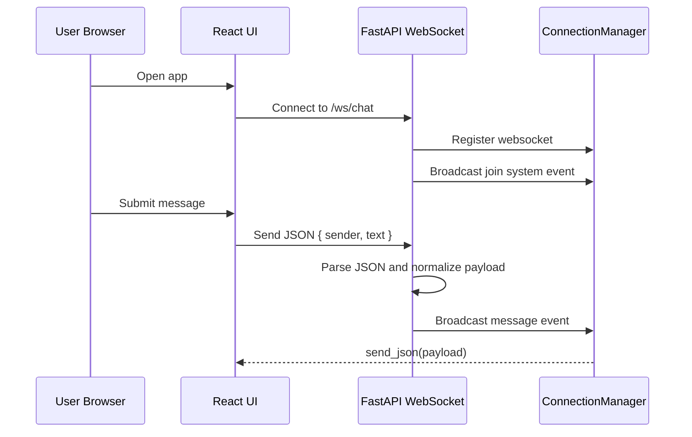
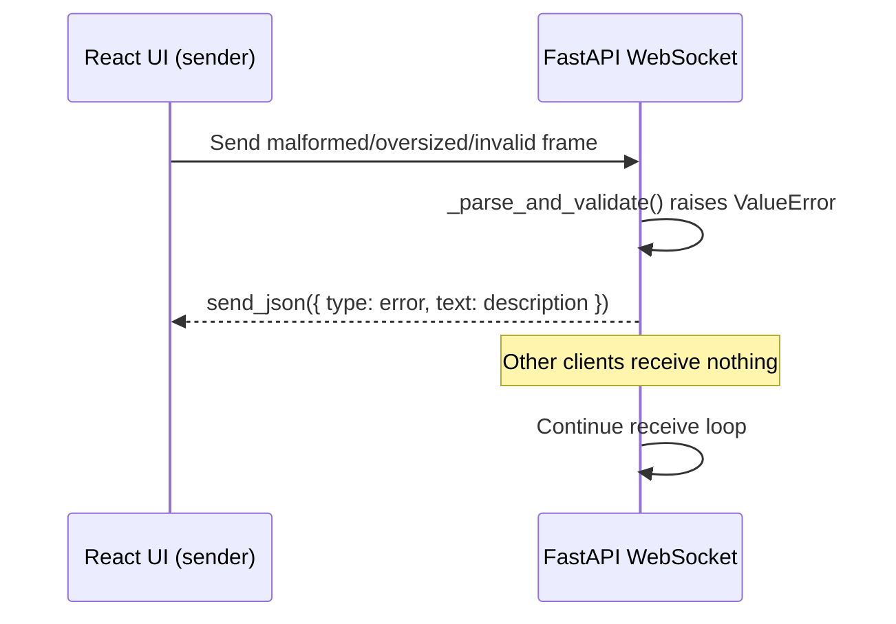

# Data Flow

## Main Chat Sequence

## Flow: Client Connect

1. Browser loads frontend and constructs WebSocket client.
2. Client connects to `ws://localhost:8000/ws/chat`.
3. Backend accepts socket and registers connection.
4. Backend broadcasts a system join event.

## Flow: Send Message

1. User submits message in frontend composer.
2. Frontend sends JSON payload: `{ sender: string, text: string }`.
3. Backend receives text frame and passes it to `_parse_and_validate()`.
4. If validation fails, backend sends `{ type: "error", text: description, sentAt }` to sender only; loop continues.
5. If `text` is blank after strip, frame is silently discarded; loop continues.
6. Backend broadcasts normalized message event to all connected clients:
   - `type: "message"`
   - `sender: string`
   - `text: string`
   - `sentAt: ISO timestamp`

## Flow: Validation Error Path

## Validation Rules Reference

| Field | Rule |
|---|---|
| Frame | ≤ 4 096 bytes (UTF-8) |
| JSON | Must be parseable as a JSON object |
| `text` | Required; must be `str`; non-empty after strip; ≤ 1 000 chars |
| `sender` | Optional; must be `str` if present; truncated to 48 chars; default `"Anonymous"` |

## Flow: Health Check

1. Client (human or monitor) calls `GET /health`.
2. Backend returns `{ "status": "ok" }`.

## Flow: Disconnect

1. Socket disconnect detected by backend.
2. Backend removes client from connection registry.
3. Backend broadcasts a system leave event.

## Integration Boundaries

- Frontend <-> Backend boundary: WebSocket JSON protocol.
- Frontend runtime config boundary: currently hard-coded socket URL in frontend code.
- External systems: none.
