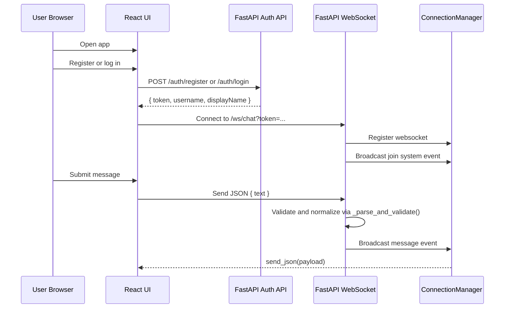
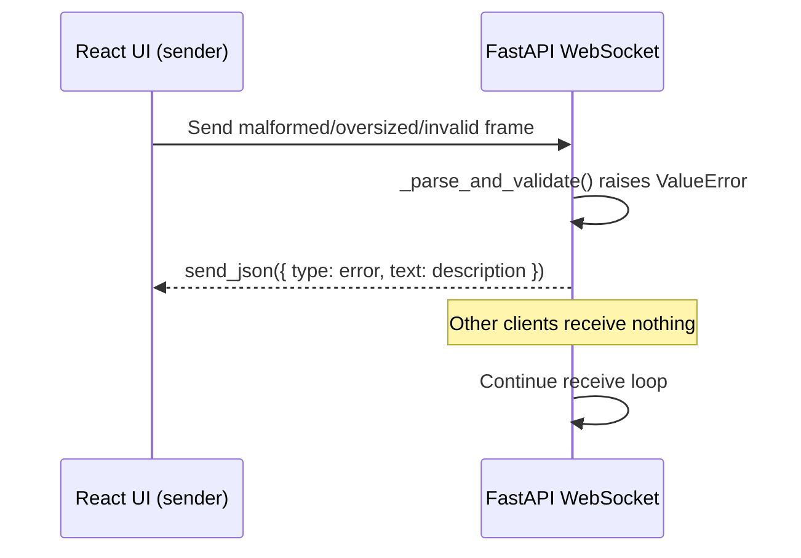

# Data Flow

## Main Chat Sequence

## Flow: Register Or Login

1. User enters username/password and, for registration, a display name.
2. Frontend derives the auth base URL from `VITE_CHAT_WS_URL` by switching the scheme from `ws` to `http` and replacing the trailing `/ws/chat` with `/auth`.
3. Frontend calls `POST /auth/register` or `POST /auth/login`.
4. Backend validates credentials, creates an in-memory session token, and returns `{ token, username, displayName }`.

## Flow: Client Connect

1. Browser loads frontend and constructs WebSocket client after a session token is available.
2. Client connects to `ws://localhost:8000/ws/chat?token=...`.
3. Backend looks up the session token and rejects the socket with close code `1008` when auth fails.
4. Backend accepts authorized sockets and registers the connection.
5. Backend broadcasts a system join event using the authenticated display name.

## Flow: Send Message

1. User submits message in frontend composer.
2. Frontend sends JSON payload: `{ text: string }`.
3. Backend receives text frame and passes it to `_parse_and_validate()`.
4. If validation fails, backend sends `{ type: "error", text: description, sentAt }` to sender only; loop continues.
5. If `text` is blank after strip, frame is silently discarded; loop continues.
6. Backend broadcasts normalized message event to all connected clients, stamping sender from the authenticated session:
   - `type: "message"`
   - `sender: string`
   - `text: string`
   - `sentAt: ISO timestamp`

## Flow: Validation Error Path

## Validation Rules Reference

| Field | Rule |
|---|---|
| Frame | ≤ 4 096 bytes (UTF-8) |
| JSON | Must be parseable as a JSON object |
| `text` | Required; must be `str`; non-empty after strip; ≤ 1 000 chars |
| `sender` | Server-owned; clients must not send it |

## Flow: Health Check

1. Client (human or monitor) calls `GET /health`.
2. Backend returns `{ "status": "ok" }`.

## Flow: Disconnect

1. The WebSocket handler exits because of client disconnect or another runtime failure.
2. Backend enters the `finally` cleanup path.
3. Backend removes the client from the in-memory connection registry if still present.
4. Backend attempts to broadcast a system leave event to remaining clients.
5. If leave-message broadcast fails, backend logs the error and preserves cleanup completion.

## Integration Boundaries

- Frontend <-> Backend boundary: HTTP JSON auth endpoints plus WebSocket JSON chat protocol.
- Frontend runtime config boundary: `VITE_CHAT_WS_URL` must resolve to the backend `/ws/chat` endpoint; the frontend derives `/auth/*` from that same base.
- External systems: none.
