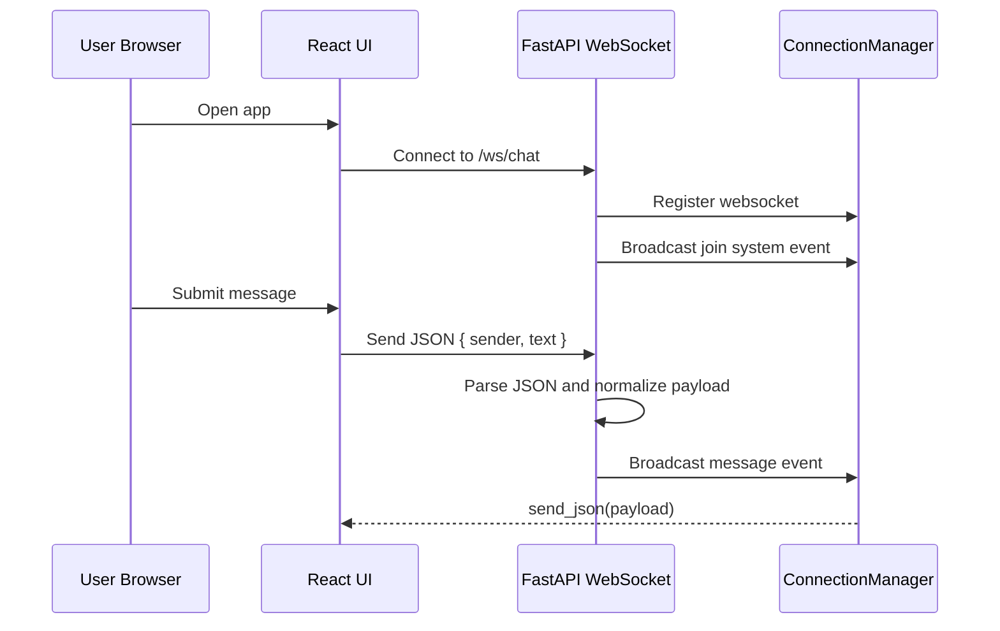

# Data Flow

## Main Chat Sequence

## Flow: Client Connect

1. Browser loads frontend and constructs WebSocket client.
2. Client connects to `ws://localhost:8000/ws/chat`.
3. Backend accepts socket and registers connection.
4. Backend broadcasts a system join event.

## Flow: Send Message

1. User submits message in frontend composer.
2. Frontend sends JSON payload:
   - `sender: string`
   - `text: string`
3. Backend receives text frame and parses JSON.
4. Backend validates non-empty `text` and default-falls `sender`.
5. Backend broadcasts normalized message event to all clients:
   - `type: "message"`
   - `sender: string`
   - `text: string`
   - `sentAt: ISO timestamp`

## Flow: Socket Error Path (Current)

1. Backend receives malformed JSON or unexpected payload content.
2. `json.loads` may raise and exit the websocket handler.
3. Connection cleanup is not guaranteed for non-disconnect exceptions.
4. Stale connection references may remain until a later broadcast cleanup attempt.

## Flow: Health Check

1. Client (human or monitor) calls `GET /health`.
2. Backend returns `{ "status": "ok" }`.

## Flow: Disconnect

1. Socket disconnect detected by backend.
2. Backend removes client from connection registry.
3. Backend broadcasts a system leave event.

## Integration Boundaries

- Frontend <-> Backend boundary: WebSocket JSON protocol.
- Frontend runtime config boundary: currently hard-coded socket URL in frontend code.
- External systems: none.
