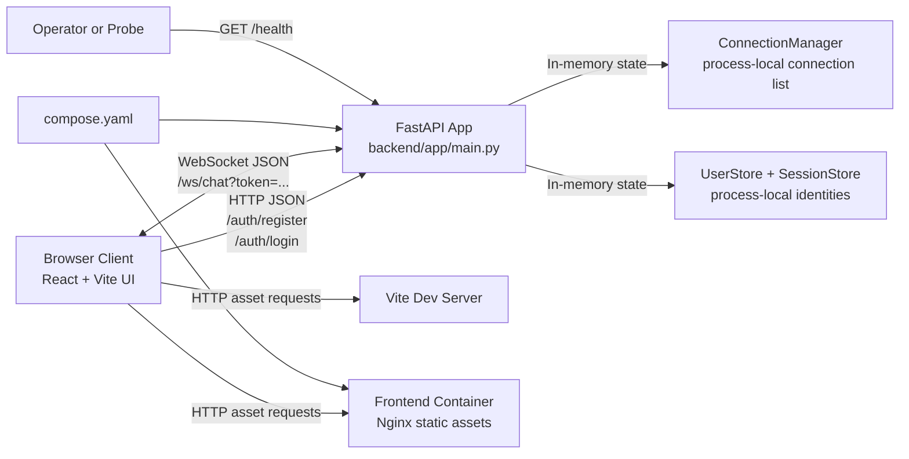

# System Overview

## Goals

- Provide a simple real-time chat experience for multiple browser clients.
- Keep implementation lightweight and easy to run locally.

## Boundaries

- Frontend runtime: browser, served by Vite dev server (`frontend/`).
- Backend runtime: FastAPI server (`backend/`).
- Container runtime: local `docker compose` with frontend Nginx container and backend Uvicorn container (`compose.yaml`).
- Persistence: none (in-memory only).
- Wire protocol: unversioned JSON messages over a single WebSocket endpoint.

## Runtime Context Narrative

- Users open the React app, register or log in over HTTP, then connect over WebSocket with a fixed-lifetime session token.
- Backend tracks active socket connections in memory.
- Backend tracks registered users and active sessions in memory.
- Backend enforces an origin allowlist for HTTP auth requests and WebSocket upgrades.
- Incoming client messages are broadcast to all active clients with sender identity derived from the authenticated session.
- Backend also emits system join/leave messages.
- Health check is exposed at `GET /health`.

## Runtime Topology

## Major Runtime Concerns

- Connection lifecycle management for disconnect/reconnect.
- Session lifecycle management for registration, login, logout, token expiry, and token validation.
- Input validation enforced via `_parse_and_validate()` (frame size, JSON parse, shape, field types, length limits).
- Sender identity is now server-owned and rejected when supplied by clients.
- Validation errors returned to sender only; no broadcast of rejected payloads.
- Auth uses fixed-lifetime in-memory bearer sessions with logout support, but users/sessions are still process-local and reset on restart.
- No data persistence or chat history retention.
- Single-process memory model limits horizontal scalability.

## Assumptions

- Development environment uses `localhost` with frontend on `5173` and backend on `8000`.
- Frontend and backend are launched separately during local development.
- Message timestamps are generated server-side in UTC ISO-8601 format.

## NFR Scorecard

| Quality | Status | Evidence | Top Remediation |
|---|---|---|---|
| Availability | 🟡 watch | In-memory process-local state only; no data persistence; health check is static. | Add persistent message store and process supervision with graceful restart strategy. |
| Performance | 🟡 watch | Broadcast loop sends per-connection sequentially from Python process memory; frame/shape limits exist but no throughput profiling or rate limiting is present. | Add per-connection rate limiting and basic latency/throughput measurements before feature growth. |
| Scalability | 🟡 watch | `ConnectionManager` is process-local list; no shared state/pub-sub for multi-instance fan-out. | Introduce Redis pub/sub (or equivalent) for horizontal scale path. |
| Security | 🟡 watch | Register/login/logout, fixed session expiry, server-owned sender identity, configured origin allowlist, and token-gated websocket access exist, but rate limiting, token rotation, and stronger production secrets policy are still absent. | Add per-connection/auth rate limiting and decide whether token rotation or stronger session storage is required. |
| Manageability | 🟡 watch | No CI workflow, no operational runbook/deployment scripts, and only basic application logging. | Add CI checks, structured logs, and minimal operational runbook. |
| Flexibility | 🟢 good | Clean frontend/backend split and simple protocol permit iterative change. | Preserve separation while introducing schema/versioning and env config. |
| Portability | 🟡 watch | Frontend socket URL is environment-driven and baseline Docker packaging now exists, but there are no production platform manifests or environment-specific deployment definitions yet. | Add production deployment manifests and document environment injection per deployment target. |
| Cost | 🟡 watch | Low current runtime footprint, but no cost controls/limits for future scaling. | Define deployment sizing defaults and autoscaling/capacity guardrails. |
| Resilience | 🟡 watch | Backend cleanup is exception-safe, but the client has no reconnect/backoff logic and there are no automated failure-injection tests for disconnect/restart scenarios. | Add client reconnect/backoff policy and backend/frontend resilience tests around restart and disconnect behavior. |
| Robustness | 🟡 watch | Invalid payloads are handled safely, but the wire contract is still implicit/unversioned and the app has no persisted recovery state. | Define a versioned message schema and add contract tests for malformed/edge-case inputs. |
| Modularity | 🟢 good | Frontend and backend are cleanly separated, and backend responsibilities are split across transport, validation, and connection-management code paths. | Preserve module boundaries while adding auth, config, and scaling adapters. |
| Reliability | 🟡 watch | Core chat flow works in a single process, but messages are lost on restart, clients do not reconnect automatically, and there is no automated regression suite in-repo. | Add reconnect behavior, persistence strategy, and automated websocket regression tests. |
| Fault Tolerance | 🟡 watch | The server tolerates malformed input and runtime exceptions within one process, but there is no redundancy, failover, or graceful degradation across process loss. | Add multi-instance/shared-state strategy and define restart/failover behavior. |
| Observability | 🔴 weak | Only basic logger calls exist for rejected payloads and unexpected exceptions; no structured logs, metrics, tracing, or alerting are present. | Add structured logging, connection/error metrics, and alerting hooks. |
| Testability | 🟡 watch | Backend auth lifecycle coverage now exists in `backend/tests/test_auth.py`, but broader websocket/chat regression coverage, frontend integration tests, and CI execution are still absent. | Extend tests to chat/reconnect paths and run them in CI. |
| Maintainability | 🟡 watch | The codebase is small and documented, and backend session/origin settings are now environment-driven, but no CI and limited automated coverage still increase change risk over time. | Extend automated validation around chat flows and deployment assumptions, then add CI enforcement. |
| Privacy and Data Protection | 🟡 watch | No server-side persistence reduces retained user data, and auth now includes logout, expiry, and origin restrictions, but there is still no explicit privacy posture or TLS deployment requirement for production use. | Define privacy/data handling expectations and require authenticated, TLS-protected deployments. |
| Usability | 🟡 watch | The UI now supports registration/login and shows auth/socket state, but there is no reconnect UX, history window, or delivery-state feedback. | Add reconnect UX/status messaging and basic session continuity behavior. |
| Accessibility | 🟡 watch | The UI uses native form controls and a visible label, but there is no `aria-live` support for new messages, no keyboard/accessibility audit, and color contrast has not been verified. | Add live-region announcements, keyboard/focus checks, and an accessibility review. |

## Deployability Assessment

### Where It Can Be Deployed Now

- Local developer machine: ready.
- Local containerized run via `docker compose`: ready.
- Single VM/manual deployment: technically possible, but it is not the intended production path.
- Containerized or managed platform deployment: target direction, with baseline Dockerfiles in place, but not yet ready because production manifests and operational hardening are absent.

### Missing For Production Deployment

- Configuration management beyond the current `VITE_CHAT_WS_URL`, `ALLOWED_ORIGINS`, and `SESSION_TTL_SECONDS` contract.
- Production deployment manifests and runtime conventions beyond the local `docker compose` baseline.
- Secrets strategy (none defined yet).
- CI/CD pipeline and automated test gate (no workflow files detected).
- Observability baseline (structured logs, metrics, alerting).
- Rollback/release strategy and environment promotion model.
- Capacity planning and load profile for websocket fan-out behavior.

### Recommended Target And Smallest Path To Production

- Target model: containerized frontend and backend on a managed platform with TLS termination and external pub/sub for scale.
- Smallest path:
	1. Extend the current backend settings model and deployment-time environment injection conventions around `VITE_CHAT_WS_URL`, `ALLOWED_ORIGINS`, and `SESSION_TTL_SECONDS`.
	2. Add production-oriented container deployment manifests on top of the local compose baseline.
	3. Add CI pipeline for lint/test/build.
	4. Add structured logging and minimum health/readiness checks.
	5. Define release and rollback procedure for frontend/backend deployments.
