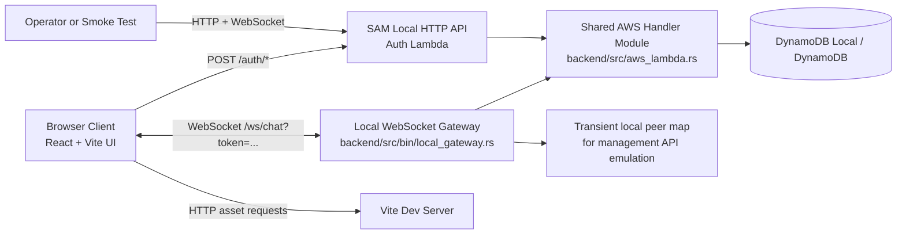

# System Overview

## Goals

- Provide a simple real-time chat experience for multiple browser clients.
- Keep one backend codebase that runs through the same AWS-oriented handler model locally and in AWS.

## Scan First (Traffic Light)

- 🔴 Act now: production observability and deployed AWS validation remain the key blockers for launch confidence.
- 🟡 Watch closely: reliability, resilience, and delivery speed are constrained by missing CI/CD and reconnect coverage.
- 🟢 Stable base: auth/session guardrails, payload validation, and backend modular separation are in place.

## Boundaries

- Frontend runtime: browser, served by Vite dev server (`frontend/`).
- Supported local backend runtime: DynamoDB Local, `sam local start-api`, and the local websocket gateway in `backend/src/bin/local_gateway.rs`.
- Additional local convenience runtime: `docker-compose.yml` can run frontend + direct Axum backend (`backend/src/main.rs`) for one-command local bring-up.
- Shared backend module: `backend/src/aws_lambda.rs` plus shared auth/validation code in `backend/src/lib.rs`.
- Optional local-only library runtime: `backend/src/lib.rs` still contains Axum-based app wiring used by tests and shared logic, but it is not the supported local backend entrypoint.
- Persistence: DynamoDB in AWS and DynamoDB Local for the supported local backend path.
- Wire protocol: unversioned JSON messages over a single WebSocket endpoint.

## Production Target Boundary

- Target frontend runtime: S3 + CloudFront.
- Target auth runtime: API Gateway HTTP API + Lambda.
- Target chat runtime: API Gateway WebSocket API + Lambda.
- Target persistence: DynamoDB for users, sessions, and active connections.
- Current status: the shared `backend/` crate now contains working Lambda handlers for DynamoDB-backed auth/session/connection state and API Gateway fan-out, plus a documented SAM local workflow; deployment automation and production operations remain incomplete.

## Runtime Context Narrative

- Users open the React app, register or log in over HTTP, then connect over WebSocket with a fixed-lifetime session token.
- The supported local backend path runs the auth API through SAM and websocket traffic through the local gateway, both backed by the shared AWS-oriented handler code.
- Shared handler code tracks users, sessions, and active connection IDs in DynamoDB or DynamoDB Local.
- Local gateway keeps only transient in-process socket senders so it can emulate the API Gateway Management API fan-out surface.
- Backend enforces an origin allowlist for auth requests and WebSocket upgrades where that path is active.
- Incoming client messages are broadcast with sender identity derived from the authenticated session.
- Backend also emits system join/leave messages.
- Health check is exposed at `GET /health`.

## Runtime Topology

## Major Runtime Concerns

- Connection lifecycle management for disconnect/reconnect.
- Session lifecycle management for registration, login, logout, token expiry, and token validation.
- Input validation enforced via `parse_and_validate()` (frame size, JSON parse, shape, field types, length limits).
- Sender identity is now server-owned and rejected when supplied by clients.
- Validation errors are rejected without being broadcast.
- The supported local path now persists users, sessions, and connections in DynamoDB Local rather than process memory.
- No data persistence or chat history retention.
- The current serverless fan-out design scans connection records and posts sequentially, so scale and cost need validation before broader rollout.

## Assumptions

- Development environment uses `localhost` with frontend on `5173`, SAM local auth on `3000`, websocket gateway on `3001`, and DynamoDB Local on `8001`.
- Frontend, SAM local auth, websocket gateway, and DynamoDB Local are launched separately during local development.
- Message timestamps are generated server-side in UTC ISO-8601 format.

## NFR Scorecard

| Quality | Status | Evidence | Top Remediation |
|---|---|---|---|
| Availability | 🟡 watch | Auth/session/connection state now persists in DynamoDB on the supported path, but there is still no message durability, no deployed AWS validation, and no production operations baseline. | Add deployed smoke tests and define graceful failure/recovery strategy for the serverless path. |
| Performance | 🟡 watch | Fan-out still posts sequentially across stored connection IDs; frame/shape limits exist but no throughput profiling or rate limiting is present. | Add per-connection rate limiting and measure serverless fan-out latency under load. |
| Scalability | 🟡 watch | Local Axum runtime is still single-process, but the AWS path now persists connection/session state in DynamoDB and fans out through the API Gateway Management API. | Validate serverless fan-out behavior under load and decide whether a single-room scan-based design remains acceptable. |
| Security | 🟡 watch | Register/login/logout, fixed session expiry, server-owned sender identity, configured origin allowlist, and token-gated websocket access exist, but rate limiting, token rotation, and stronger production secrets policy are still absent. | Add per-connection/auth rate limiting and decide whether token rotation or stronger session storage is required. |
| Manageability | 🟡 watch | No CI workflow, no operational runbook/deployment scripts, and only basic application logging. | Add CI checks, structured logs, and minimal operational runbook. |
| Flexibility | 🟢 good | Clean frontend/backend split and simple protocol permit iterative change. | Preserve separation while introducing schema/versioning and env config. |
| Portability | 🟡 watch | Frontend socket/auth URLs are environment-driven, baseline Docker packaging exists, and the same backend crate now supports Axum and Lambda execution, but deployment automation and production validation are still incomplete. | Finish AWS deployment automation and document environment injection per deployment target. |
| Cost | 🟡 watch | Lambda can reduce always-on compute cost, but API Gateway WebSocket connection-minute billing and DynamoDB usage are not yet modeled. | Define AWS cost guardrails and expected connection/message usage envelopes. |
| Resilience | 🟡 watch | Backend cleanup is exception-safe, but the client has no reconnect/backoff logic and there are no automated failure-injection tests for disconnect/restart scenarios. | Add client reconnect/backoff policy and backend/frontend resilience tests around restart and disconnect behavior. |
| Robustness | 🟡 watch | Invalid payloads are handled safely, but the wire contract is still implicit/unversioned and the app has no persisted recovery state. | Define a versioned message schema and add contract tests for malformed/edge-case inputs. |
| Modularity | 🟢 good | Frontend and backend are cleanly separated, and backend responsibilities are split across transport, validation, and connection-management code paths. | Preserve module boundaries while adding auth, config, and scaling adapters. |
| Reliability | 🟡 watch | Core local chat flow works in a single process, and the AWS path now persists auth/session/connection state, but clients still do not reconnect automatically and the serverless path lacks end-to-end deployment validation. | Add reconnect behavior and automated regression tests for the serverless flow. |
| Fault Tolerance | 🟡 watch | Handler failures no longer imply identity-state loss on the supported path, but websocket fan-out and local gateway behavior still lack redundancy or graceful degradation definitions. | Define failover behavior and add tests around partial fan-out and stale connection cleanup. |
| Observability | 🔴 weak | Only basic logger calls exist for rejected payloads and unexpected exceptions; no structured logs, metrics, tracing, or alerting are present. | Add structured logging, connection/error metrics, and alerting hooks. |
| Testability | 🟡 watch | Backend auth lifecycle coverage now exists in `backend/tests/auth_lifecycle.rs`, but broader websocket/chat regression coverage, frontend integration tests, and CI execution are still absent. | Extend tests to chat/reconnect paths and run them in CI. |
| Maintainability | 🟡 watch | The codebase is small and documented, and backend session/origin settings are now environment-driven, but no CI and limited automated coverage still increase change risk over time. | Extend automated validation around chat flows and deployment assumptions, then add CI enforcement. |
| Privacy and Data Protection | 🟡 watch | The supported path now persists user and session records in DynamoDB, and auth includes logout, expiry, and origin restrictions, but there is still no explicit privacy posture, retention policy, or TLS deployment requirement for production use. | Define privacy/data handling expectations, retention rules, and require authenticated, TLS-protected deployments. |
| Usability | 🟡 watch | The UI now supports registration/login and shows auth/socket state, but there is no reconnect UX, history window, or delivery-state feedback. | Add reconnect UX/status messaging and basic session continuity behavior. |
| Accessibility | 🟡 watch | The UI uses native form controls and a visible label, but there is no `aria-live` support for new messages, no keyboard/accessibility audit, and color contrast has not been verified. | Add live-region announcements, keyboard/focus checks, and an accessibility review. |

## Deployability Assessment

### Where It Can Be Deployed Now

- Local developer machine: ready.
- Single VM/manual deployment: technically possible, but it is not the intended production path.
- AWS serverless deployment: functionally implemented in the shared `backend/` crate and scaffolded through `infra/aws/template.yaml`, but not yet production-ready because CI/CD, observability, and deployment validation are still missing.

### Missing For Production Deployment

- Configuration management beyond the current `VITE_CHAT_WS_URL`, `VITE_AUTH_BASE_URL`, `ALLOWED_ORIGINS`, `SESSION_TTL_SECONDS`, and AWS table/runtime settings.
- Complete AWS deployment manifests/runtime conventions beyond the current SAM scaffold and local invoke workflow.
- Secrets strategy (none defined yet).
- CI/CD pipeline and automated test gate (no workflow files detected).
- Observability baseline (structured logs, metrics, alerting).
- Rollback/release strategy and environment promotion model.
- Capacity planning and load profile for websocket fan-out behavior.
- Production validation for the DynamoDB-backed Lambda path, including local `sam local` verification and deployed smoke tests.

### Recommended Target And Smallest Path To Production

- Target model: S3 + CloudFront frontend plus API Gateway and Lambda for auth/chat, backed by DynamoDB for persistent state.
- Smallest path:
	1. Validate the shared Lambda path through the existing SAM-local workflow and deployed AWS smoke tests.
	2. Add CI pipeline, SAM validation/deploy path, and deployment-time environment injection conventions.
	3. Add structured logging, metrics, and alarms for Lambda and API Gateway.
	4. Define scale/cost guardrails for sequential websocket fan-out and API Gateway connection-minute usage.
	5. Define release and rollback procedure for frontend/backend deployments.
