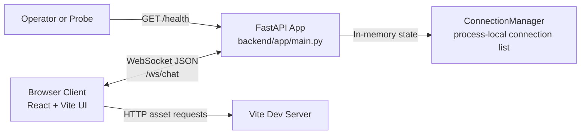

# System Overview

## Goals

- Provide a simple real-time chat experience for multiple browser clients.
- Keep implementation lightweight and easy to run locally.

## Boundaries

- Frontend runtime: browser, served by Vite dev server (`frontend/`).
- Backend runtime: FastAPI server (`backend/`).
- Persistence: none (in-memory only).
- Wire protocol: unversioned JSON messages over a single WebSocket endpoint.

## Runtime Context Narrative

- Users open the React app and connect over WebSocket to the backend.
- Backend tracks active socket connections in memory.
- Incoming client messages are broadcast to all active clients.
- Backend also emits system join/leave messages.
- Health check is exposed at `GET /health`.

## Runtime Topology

## Major Runtime Concerns

- Connection lifecycle management for disconnect/reconnect.
- Input validation enforced via `_parse_and_validate()` (frame size, JSON parse, shape, field types, length limits).
- Validation errors returned to sender only; no broadcast of rejected payloads.
- No authentication or authorization in current scope.
- No data persistence or chat history retention.
- Single-process memory model limits horizontal scalability.

## Assumptions

- Development environment uses `localhost` with frontend on `5173` and backend on `8000`.
- Frontend and backend are launched separately during local development.
- Message timestamps are generated server-side in UTC ISO-8601 format.

## NFR Scorecard

| Quality | Status | Evidence | Top Remediation |
|---|---|---|---|
| Availability | 🔴 weak | Only in-memory process state; no restart recovery behavior; no health dependency checks beyond static `GET /health` response. | Add process supervision + graceful restart strategy and harden socket exception cleanup. |
| Performance | 🟡 watch | Broadcast loop sends per-connection sequentially from Python process memory; no throughput limits or profiling. | Add payload limits and basic latency/throughput measurements before feature growth. |
| Scalability | 🟡 watch | `ConnectionManager` is process-local list; no shared state/pub-sub for multi-instance fan-out. | Introduce Redis pub/sub (or equivalent) for horizontal scale path. |
| Security | 🔴 weak | No auth; sender identity is client-supplied; no explicit payload size/rate controls. | Add authn/authz boundary and server-owned identity fields with rate/payload guards. |
| Manageability | 🟡 watch | No CI workflow, no structured logging, no runbook/deployment scripts. | Add CI checks, structured logs, and minimal operational runbook. |
| Flexibility | 🟢 good | Clean frontend/backend split and simple protocol permit iterative change. | Preserve separation while introducing schema/versioning and env config. |
| Portability | 🟡 watch | Works locally but socket URL hard-coded to localhost and no container spec exists. | Move URL to env config and add Docker-based runtime packaging. |
| Cost | 🟡 watch | Low current runtime footprint, but no cost controls/limits for future scaling. | Define deployment sizing defaults and autoscaling/capacity guardrails. |
| Resilience | 🔴 weak | Non-disconnect websocket errors can bypass explicit cleanup path; no retry/backoff policy documented. | Add exception-safe cleanup, client reconnect/backoff policy, and failure tests. |

## Deployability Assessment

### Where It Can Be Deployed Now

- Local developer machine: ready.
- Single VM/manual deployment: possible with manual process startup for frontend and backend.
- Containerized or managed platform deployment: not yet ready as no Dockerfile/compose or platform manifests are present.

### Missing For Production Deployment

- Configuration management for runtime endpoints (frontend currently hard-codes WebSocket URL).
- Secrets strategy (none defined yet).
- CI/CD pipeline and automated test gate (no workflow files detected).
- Observability baseline (structured logs, metrics, alerting).
- Rollback/release strategy and environment promotion model.
- Capacity planning and load profile for websocket fan-out behavior.

### Recommended Target And Smallest Path To Production

- Target model: containerized frontend and backend on a managed platform with TLS termination and external pub/sub for scale.
- Smallest path:
	1. Introduce environment-based socket config (`VITE_CHAT_WS_URL`) and backend settings model.
	2. Complete websocket resilience hardening (broad exception handling + guaranteed disconnect/finally path) and cover it with tests.
	3. Add Dockerfiles and a simple compose/dev deployment profile.
	4. Add CI pipeline for lint/test/build.
	5. Add structured logging and minimum health/readiness checks.
