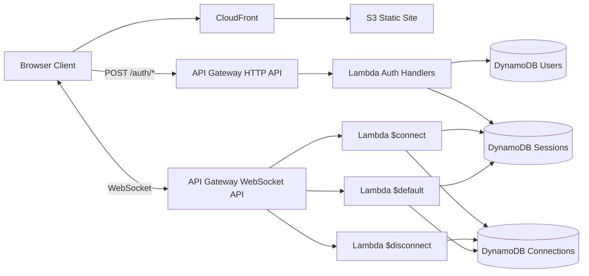

# AWS Serverless Target

## Goal

Deploy the chat app on AWS with pay-per-use backend billing.

## Important Constraint

The current backend in `backend/src/lib.rs` cannot be deployed to Lambda unchanged. It holds active WebSocket connections, users, and sessions in process memory, which only works while a single server process stays alive.

## AWS-Native Target Shape



## Required Backend Split

1. Auth Lambda
   - Handles `POST /auth/register`, `POST /auth/login`, and `POST /auth/logout`.
   - Stores users and fixed-lifetime sessions in DynamoDB.

2. WebSocket Connect Lambda
   - Validates the bearer token from the WebSocket connect request.
   - Writes the API Gateway connection ID and user identity to DynamoDB.

3. WebSocket Disconnect Lambda
   - Removes the connection record from DynamoDB.

4. WebSocket Message Lambda
   - Validates inbound payloads.
   - Resolves the authenticated sender from DynamoDB.
   - Uses the API Gateway Management API to fan out messages to active connection IDs.

## Data Model

- `Users`
  - Partition key: `username`
  - Stores display name, password salt, password hash, timestamps

- `Sessions`
  - Partition key: `token`
  - Stores username, display name, expiry timestamp
  - Use DynamoDB TTL on expiry attribute

- `Connections`
  - Partition key: `connectionId`
  - Stores username, display name, connected-at timestamp

## Frontend Changes Needed

- `VITE_CHAT_WS_URL` must point at the API Gateway WebSocket URL in production.
- `VITE_AUTH_BASE_URL` can override auth base URL derivation when the HTTP API is exposed on a different public hostname or path than the WebSocket API.

## Scaffold Added In Repo

- `template.yaml` now provides the first AWS SAM scaffold for:
   - S3 frontend bucket
   - DynamoDB `Users`, `Sessions`, and `Connections` tables
   - API Gateway HTTP API routes for `POST /auth/register`, `POST /auth/login`, and `POST /auth/logout`
   - API Gateway WebSocket routes for `$connect`, `$disconnect`, and `$default`
- `../../backend/` now contains both the local Axum server and the Lambda binaries wired by the SAM template.

## Current Handler Status

- `auth` handler:
   - `register` persists users and sessions in DynamoDB.
   - `login` loads users from DynamoDB and mints new session records.
   - `logout` revokes persisted sessions in DynamoDB.
- `ws_connect`, `ws_disconnect`, and `ws_message` handlers:
   - persist and clean up websocket connection records in DynamoDB
   - preserve the frontend payload contract by routing `{ "text": ... }` through the `$default` websocket route
   - fan out messages through the API Gateway Management API when a management endpoint is available

## Local SAM Workflow

This repo now includes a local path for the same Lambda handlers that run in AWS.

1. Start DynamoDB Local:
   - `docker compose -f compose.aws-local.yaml up -d`
2. Create the local DynamoDB tables:
   - `cd backend && make local-dynamodb-init`
3. Build the Lambda artifacts:
   - `cd backend && make sam-build`
4. Run the auth API locally through SAM:
   - `cd backend && make sam-local-api`
5. Run the local websocket gateway that emulates API Gateway's websocket + management API surface against the same shared Lambda handler code:
   - `cd backend && make sam-local-ws-gateway`
6. Optional direct websocket handler invokes remain available for slice testing:
   - `cd backend && make sam-local-ws-connect`
   - `cd backend && make sam-local-ws-message`
   - `cd backend && make sam-local-ws-disconnect`

Artifacts included for local runs:

- `env.local.json`: environment overrides for SAM local, including the DynamoDB Local endpoint
- `events/ws-connect.json`: sample `$connect` event
- `events/ws-message.json`: sample `$default` message event
- `events/ws-disconnect.json`: sample `$disconnect` event

Notes:

- The supported frontend-facing local stack is `sam local start-api` plus `make sam-local-ws-gateway`; the old Axum local app path is no longer used.
- Update `events/ws-connect.json` with a real session token returned by the local auth API before invoking the direct connect handler.

## Build Notes

- The SAM Makefile expects `cargo-lambda` for producing Linux `bootstrap` binaries.
- `cargo test` in `backend/` validates both the existing local server code and the shared AWS handler module.
- The local SAM workflow expects a working SAM CLI. The repo-local path documented in [README.md](../../README.md) uses `.sam-venv/bin/sam`.

## Cost Model Notes

- Lambda aligns backend cost to request and message volume.
- API Gateway WebSocket is not free while users keep sockets open; AWS bills for connection minutes and messages.
- This is still closer to the desired pay-for-usage model than running an always-on container for the current backend.

## Remaining Work

## Deployed Smoke Validation

After deploying the stack, run the same end-to-end auth plus websocket flow against the real AWS endpoints:

```bash
cd backend
AWS_STACK_NAME=<your-stack-name> AWS_REGION=<your-region> make aws-deployed-smoke
```

The Makefile resolves these CloudFormation outputs automatically:

- `HttpApiUrl`
- `WebSocketApiUrl`

It then runs the ignored deployed smoke test in `backend/tests/aws_local_smoke.rs` against:

- `POST <HttpApiUrl>/auth/register`
- `wss://.../prod?token=...` on the deployed `$default` websocket route

If you prefer to bypass CloudFormation output resolution, provide the endpoints directly:

```bash
cd backend
SMOKE_AUTH_BASE_URL=https://.../auth SMOKE_CHAT_WS_URL=wss://.../prod make aws-deployed-smoke
```

## Remaining Work

1. Run the deployed smoke path against a real AWS stack and keep it in the release checklist.
2. Decide whether to provide a local API Gateway Management API shim for full websocket fan-out during local invocation.
3. Add CI/CD and observability for the AWS target.
4. Update frontend production env vars for deployed AWS endpoints.